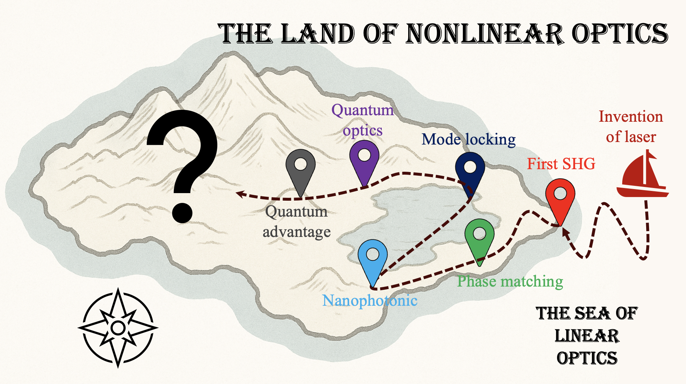
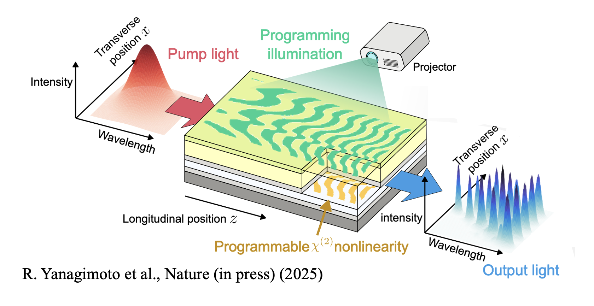
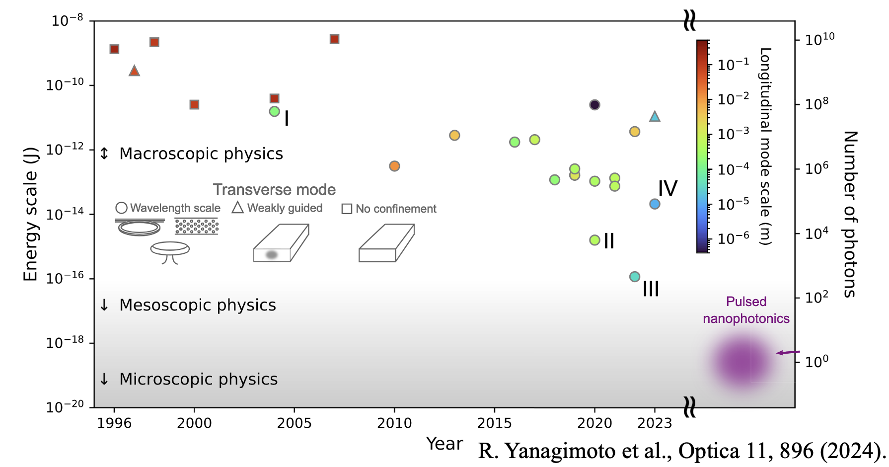
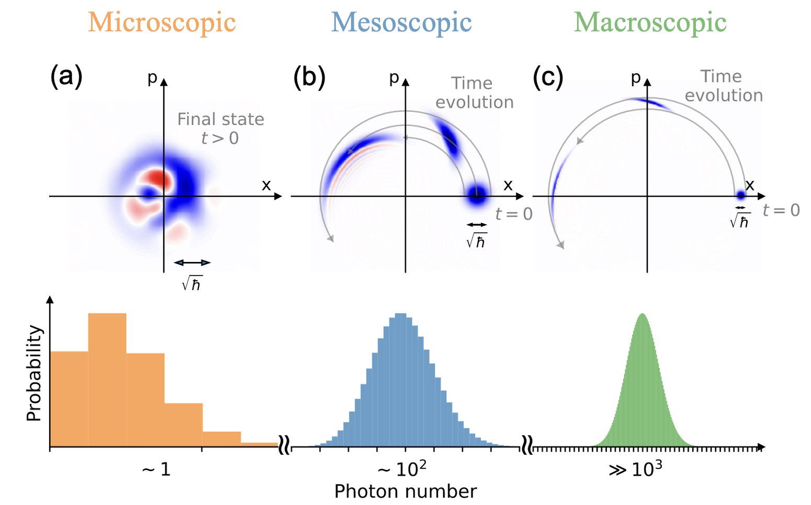

I am a researcher at <a href="https://ntt-research.com">NTT Research</a> working on ultrafast, quantum, and nonlinear optics. I was a postdoctoral scholar at Cornell University with <a href="https://mcmahon.aep.cornell.edu">Prof. Peter McMahon</a> between 2023-2025. I acquired a Ph.D. in applied physcs at Stanford University with <a href="https://mabuchilab.org">Prof. Hideo Mabuchi</a> in 2023, and a B.E. in applied physics at the University of Tokyo with <a href="https://www.amo.t.u-tokyo.ac.jp/katori/">Prof. Hidetoshi Katori</a> in 2017. Please refer to a <a href="{{ base_path }}/cv" rel="permalink">curriculum vitae</a> for full details.

Research interest: What is the next frontier of nonlinear optics?
---
The beginning of nonlinear optics was marked by the first demonstration of second-harmonic generation (SHG) in 1961[1]. Since then, nonlinear optics has become significantly more functional, complex, and interesting. The scope of contemporary nonlinear optics extends far beyond what was originally imagined, spanning functions that cover the entire electromagnetic spectrum, both narrowband and broadband, and both classical and quantum. Such progress has been achieved through multiple stages of revolution, including the inventions of phase matching, mode locking, nanophotonics, and quantum optics. 

A vertical thread of my research interest lies in exploring possible forms of next-generation nonlinear optics, with the hope of contributing to an invention that transcends the present form of contemporary nonlinear optics. Below are a few topics I have worked on.

Programmable nonlinear photonics
---
Much of the functionality of a photonic device is typically not present in the raw materials in their naturally available forms. Instead, device functions are usually engineered by “sculpting” structures through nanofabrication processes. While this approach has driven decades of progress in the field, it also means that device functions are fixed at the stage of fabrication and cannot be changed afterward. This not only limits the scope of applications but also makes devices prone to fabrication errors and post-fabrication drifts, severely reducing yield. These limitations also apply to nonlinear photonics, where essential device properties, such as phase-matching conditions and dispersions, are permanently engraved into the device structures. A photonic device that can reconfigure its nonlinear-optical functions in real time could break such "one-device--one-function" paradigm, reshaping the way we use nonlinear optics.

In our recent work[2], we fabricated a prototypical device to take a step forward into this real of "programmable nonlinear photonics". On this planer waveguide, we can realize an arbitrary two-dimensional distribution of χ(2) nonlinearity by shining a programming illumination on the surface of the device, where the pattern of the illumination directly maps to the pattern of χ(2) nonlinearity. Such programmable χ(2) nonlinearity allows us to reconfigure the nonlinear-optical functions of the device in real time via engineering quasi-phase matching. Please refere to <a href="https://arxiv.org/abs/2503.19861">the paper</a> for full details.

The full scope of programmable nonlinear photonics has yet to be fully explored, but several exciting demonstrations already exist. In Ref.[3], an optically pumped semiconductor was used to realize field-programmable nonlinear gain and loss. Ref.[4] employed a ferroelectric liquid crystal to achieve tunable entangled photon generation. Ref.[5] demonstrated programmable pulse shaping via Bragg scattering in a nonlinear fiber. The diversity of functions demonstrated and the range of physical processes employed highlight that we have just started to take a peek at this new frontier of nonlinear optics.

Mesoscopic nonlinear optics: A <i>very</i> nonlinear nonlinear optics
---
The first demonstration of nonlinear optics was extremely inefficient. It employed as much as 3 joules of pulse energy[1], yet the SHG signal was so weak that the editors of PRL mistook it for dust in the figure. Today, state-of-the-art nonlinear photonic devices can achieve near-unit-efficiency frequency conversion with pump energies as low as 100 attojoules[6,7], marking nearly ten quadrillion-fold improvement in efficiency. In this sense, nonlinear optics has become significantly more “nonlinear” over the past few decades. A very natural question is: what will happen as nonlinear optics continues to become more nonlinear?

While we usually describe the light field using continuous numbers, its energy can only take discrete values. An important energy scale to keep in mind is about 0.1 attojoule, which is the approximate energy of a single photon. At the previously mentioned scale of 100 attojoules, this corresponds to about 1,000 photons, where the continuous-valued description of light is barely valid. As the energy scale of nonlinear optics decreases, the discrete (i.e., quantum) nature of photons becomes increasingly pronounced (see figure below). This motivates the study of nonlinear optics at the mesoscale, where transitions between classical intuitions and microscopic quantum descriptions take place[8]. In this unique regime, only dozens to hundreds of pump photons are sufficient to trigger saturated nonlinear dynamics, and naive intuitions from classical nonlinear optics (or even the microscopic quantum optics) break down.

The physics of nonlinear optics in the mesoscopic regime is still largely unexplored, but studies already suggest this may be a very fertile frontier. Nonlinear photonic devices operating in this regime are predicted to exhibit functions distinctive from their classical counterpart, showing passways, e.g., for all-optical quantum computation[9]. The interplay between immense multimodeness of ultrafast optics and quantum nonlinearity could lead to complex yet rich emergent dynamics[10]. The proof-of-concept experiments using cryogenic atomic clouds demonstrated the emergence of many-body physics of photons[11]. Leveraging these novel physics could open unique functions and applications of nonlinear optics. Please refer to our <a href="https://doi.org/10.1364/OPTICA.514075">review article</a> for full details.

<!-- 
Broadband quantum optics: ultrafast optics in strongly interacting regime
---

Traditionally, theoretical and experimental explorations of quantum optics have often concerned nonlinear resonators that support and enhance nonlinear interactions among few photonic modes (e.g., in cavity QED or microwave supercondicting circuits). In these systems, nonlinear dynamical rate could be greater than the dissipation rate (i.e., strongly interacting regime), enabling access to exotic non-Gaussian quantum states.

On the other hand, in the field of ultrafast nonlinear optics, it is not unusual to observe an octave-spanning spectrum; An optical pulse propagating in a dispersion-engineered waveguide can trigger highly nonlinear dynamics among an immense number of frequency modes, which can significantly broaden the spectrum even for a narrow-band input (e.g., supercontinuum generation).

Although both few-mode quantum optics and ultrafast nonlinear optics concern the physics of the same elementary particle, i.e., photon, their conceptual frameworks vastly differ. Aside from the fundamental interests regarding multimode quantum systems in general, advances in dispersion-engineered nonlinear photonics have made it plausible to experimentally realize photons that are both broadband and strongly interacting, underscoring the need to establish quantum theories that address this largely unexplored regime of quantum optics, which I refer to as "broadband quantum optics".

My research interest is on unraveling and engineering the physics of broadband quantum optics; Rich but complicated multimode dynamics of photons can either be seen as "errors" on conventional few-mode quantum optics, or be harnessed to realize a new paradigm of powerful quantum engineering and/or information processing. -->

References:
<ol> 
<li>P. A. Franken et al., "Generation of Optical Harmonics," Phys. Rev. Lett. <b>7
</b>, 118 (1961). </li>
<li>R. Yanagimoto et al., "Programmable on-chip nonlinear photonics," Nature (in press) (2025).</li>
<li>T. Wu et al., "Field-programmable photonic nonlinearity," Nat. Photon. <b>19</b>, 725 (2025).</li>
<li>V. Sultanov et al., "Tunable entangled photon-pair generation in a liquid crystal," Nature <b>631</b>, 294 (2024).</li>
<li>G. Bashan et al., "Optically programable quasi phase matching in four-wave mixing," Nat. Commun. <b>16</b>, 6855 (2025).</li>

<li>J. Lu et al., "Toward 1% single-photon anharmonicity with periodically poled lithium niobate microring resonators," Optica <b>7</b>, 1654 (2020). </li>
<li> M. Zhao and K. Fang, "InGaP quantum nanophotonic integrated circuits with 1.5% nonlinearity-to-loss ratio," Optica <b>9</b>, 258 (2022). </li>

<li>R. Yanagimoto et al., "Mesoscopic ultrafast nonlinear optics—the emergence of multimode quantum non-Gaussian physics," Optica <b>11
</b>, 896 (2024). </li>

<li>R. Yanagimoto et al., "Quantum Nondemolition Measurements with Optical Parametric Amplifiers for Ultrafast Universal Quantum Information Processing," PRX Quantum <b>4
</b>, 010333 (2023). </li>

<li>M. A. Guidry et al., "Quantum optics of soliton microcombs," Nat. Photon. <b>16</b>, 52 (2022).</li>

<li>D. E. Chang et al., "Quantum nonlinear optics — photon by photon," Nat. Photon. <b>8</b>, 685 (2014).</li>

<!-- <li>J. Roslund et al., "Wavelength-multiplexed quantum networks with ultrafast frequency combs," Nat. Photon. <b>8</b>, 109 (2014).</li>
<li>M. Jankowski et al., "Ultrabroadband nonlinear optics in nanophotonic periodically poled lithium niobate waveguides," Optica <b>7</b>, 40 (2020).</li>
<li>R. Yanagimoto et al., "Efficient simulation of ultrafast quantum nonlinear optics with matrix product states," Optica <b>8</b>, 1306 (2021).</li> -->
</ol>