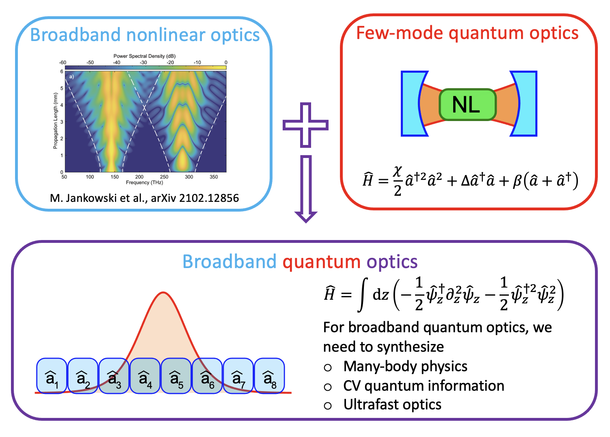

I am a Ph.D. candidate in Applied Physics at Stanford University, working at <a href="https://mabuchilab.org">Mabuchilab</a>. While my research interests span across AMO physics and quantum photonics in general, my primary research interest is on understanding and engineering broadband quantum dynamics of optical photons in highly nonlinear systems. I got a BE in Applied Physics at the University of Tokyo, where I worked on an experiment of optical lattice clocks at the <a href="http://www.amo.t.u-tokyo.ac.jp/e_index.html">quantum metrology lab</a>.

Broadband quantum optics: ultrafast optics in strongly interacting regime
---

Traditionally, theoretical and experimental explorations of quantum optics have often concerned nonlinear resonators that support and enhance nonlinear interactions among few photonic modes (e.g., in cavity QED or microwave supercondicting circuits). In these systems, nonlinear dynamical rate could be greater than the dissipation rate (i.e., strongly interacting regime), enabling access to exotic non-Gaussian quantum states.

On the other hand, in the field of ultrafast nonlinear optics, it is not unusual to observe an octave-spanning spectrum; An optical pulse propagating in a dispersion-engineered waveguide can trigger highly nonlinear dynamics among an immense number of frequency modes, which can significantly broaden the spectrum even for a narrow-band input (e.g., supercontinuum generation).

Although both few-mode quantum optics and ultrafast nonlinear optics concern the physics of the same elementary particle, i.e., photon, their conceptual frameworks vastly differ. Aside from the fundamental interests regarding multimode quantum systems in general, advances in dispersion-engineered nonlinear photonics have made it plausible to experimentally realize photons that are both broadband and strongly interacting, underscoring the need to establish quantum theories that address this largely unexplored regime of quantum optics, which I refer to as "broadband quantum optics".

My research interest is on unraveling and engineering the physics of broadband quantum optics; Rich but complicated multimode dynamics of photons can either be seen as "errors" on conventional few-mode quantum optics, or be harnessed to realize a new paradigm of powerful quantum engineering and/or information processing.

References:
<ol>
<li>J. Lu et al., "Toward 1% single-photon anharmonicity with periodically poled lithium niobate microring resonators," Optica <b>7</b>, 1654 (2020). </li>
<li>D. E. Chang et al., "Quantum nonlinear optics — photon by photon," Nat. Photon. <b>8</b>, 685 (2014).</li>
<li>J. Roslund et al., "Wavelength-multiplexed quantum networks with ultrafast frequency combs," Nat. Photon. <b>8</b>, 109 (2014).</li>
<li>M. Jankowski et al., "Ultrabroadband nonlinear optics in nanophotonic periodically poled lithium niobate waveguides," Optica <b>7</b>, 40 (2020).</li>
<li>R. Yanagimoto et al., "Efficient simulation of ultrafast quantum nonlinear optics with matrix product states," Optica <b>8</b>, 1306 (2021).</li>
</ol>